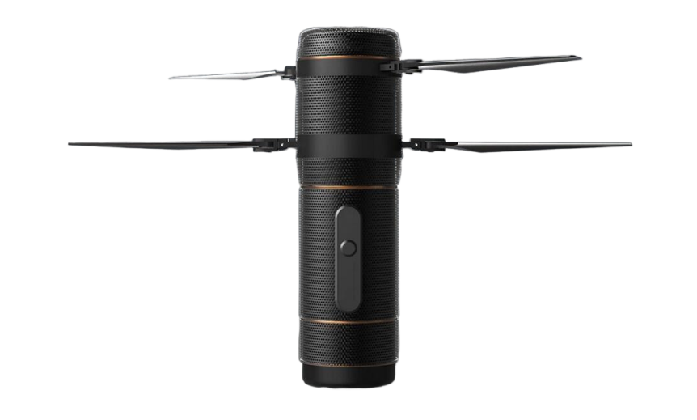

# Fan Yang's Home Page

### News
* :school: **15/04/2024** Graduated from [FastLab](http://zju-fast.com/) and join in [Agibot](https://agibot.com/) working on mobile manipulation with humanoid robot system.
* :rocket: **15/01/2023** Our paper [Ring-Rotor: A Novel Retractable Ring-Shaped Quadrotor With Aerial Grasping and Transportation Capability](https://ieeexplore.ieee.org/document/10044964) is accpeted by IEEE Robotics and Automation Letters .

### Papers

* :orange_book: **RAL2023** Ring-Rotor: A Novel Retractable Ring-Shaped Quadrotor With Aerial Grasping and Transportation Capability [:page_facing_up:](https://ieeexplore.ieee.org/document/10044964) [:movie_camera:](https://www.bilibili.com/video/BV1gY4y1K723/)

  <!-- 解注释支持视频显示 -->
  <!--  -->
  <!--  -->

### Projects
* :helicopter: **Coaxial UAV Swarm** : a swarm navigation stack for coaxial UAV systems. 

  

* :space_invader: **RoboRTS** : an open source software stack for Real-Time Strategy research on mobile robots. 

  

  The entire project is built upon the RoboMaster University AI Challenge, an event held as part of the IEEE International Conference on Robotics and Automation (ICRA) from 2017 to 2021 [:movie_camera:](https://www.bilibili.com/video/BV1xV41147Ci/?share_source=copy_web&vd_source=0a2934a8448f6587984e9efb9cb05d3a). 
  
  It is officially open-sourced and developed in collaboration with the ROS community:
  - ROS Navigation/Decision/Game Stack: [RoboRTS](https://github.com/robomaster/roborts)
  - Latest ROS SDK: [RoboRTS-Base](https://github.com/robomaster/roborts-base)
  - Embedded Firmware: [RoboRTS-Firmware](https://github.com/robomaster/roborts-firmware)
  
* :robot: **RoboMaster S1/EP** : a game-changing educational robot built to unlock the potential in every learner. 

   

  The robot is supported to program using Scratch and [Python SDK](https://github.com/dji-sdk/RoboMaster-SDK)

### Talks

"RoboMaster AI Challenge with ROS" China 2022 ROS Summer Camp, Hefei, China [:movie_camera:](https://www.bilibili.com/video/BV1sS4y1W71g/?spm_id_from=333.999.0.0&vd_source=a1897a22c52923494ce23a38426c92e1)

"Teaching Exploration of Robotics and Artificial Intelligence" DJI Education Online Open Class [:movie_camera:](https://open.163.com/newview/movie/free?pid=RHKK1TJEJ&mid=KHKK1TKIP)
