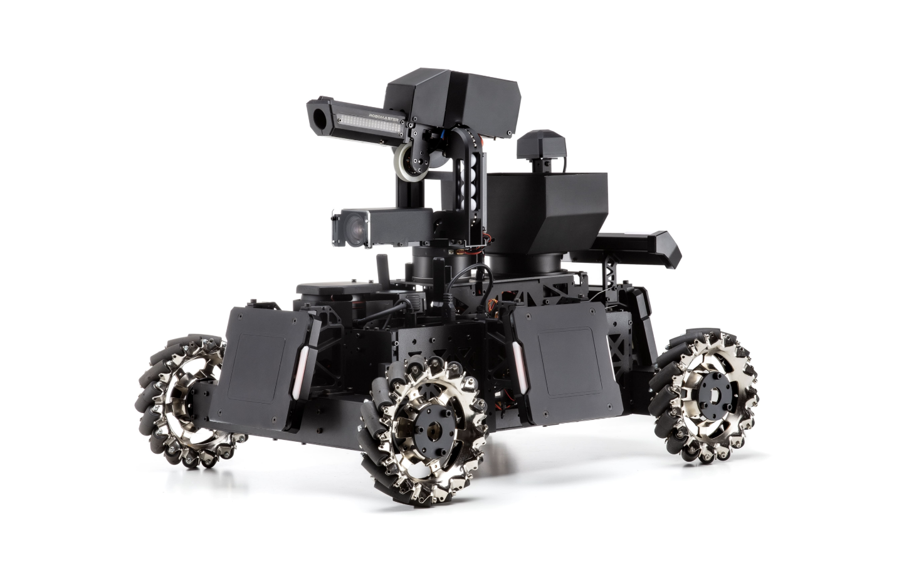
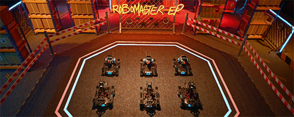

# Fan Yang's Home Page

### News

* :(fas fa-rocket fa-fw): **01/06/2021** The [RoboMaster University AI Challenge](http://2011.ieee-icra.org/competitions.html) is held in the IEEE International Conference on Robotics and Automation (ICRA), Xi'an
  <!--  -->
* :(fas fa-plane fa-fw): **07/04/2021** Resigned and Graduated from DJI

### Projects

* :(fas fa-chess fa-fw): **RoboRTS** : an open source software stack for Real-Time Strategy research on mobile robots. 

  

  Whole project is based on ROS and open sourced 
* :(fas fa-robot fa-fw): **RoboMaster S1/EP** : a game-changing educational robot built to unlock the potential in every learner. 

   

  The robot is supported to program using Scratch and Python 
